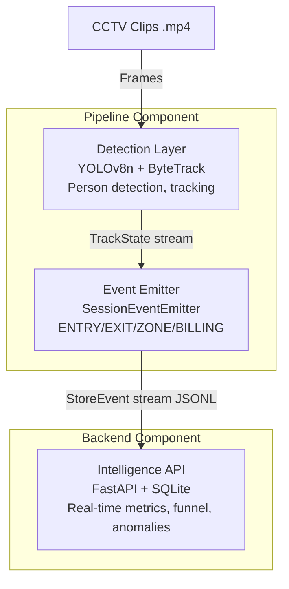

# Store Intelligence


> A real-time retail analytics pipeline transforming raw CCTV footage into structured events and providing a live store intelligence API.

## Table of Contents
- [Overview](#-overview)
- [Key Features](#-key-features)
- [Architecture](#-architecture)
- [Prerequisites](#-prerequisites)
- [Quick Start](#-quick-start)
- [Usage](#-usage)
  - [Detection Pipeline](#running-the-detection-pipeline)
  - [Live Dashboard](#live-dashboard)
- [API Endpoints](#-api-endpoints)
- [Design Decisions](#-design-decisions)
- [Project Structure](#-project-structure)
- [Testing](#-testing)

---

## Overview

**What problem does it solve?**
Retail stores generate vast amounts of CCTV footage that often go unused for business insights. Store Intelligence bridges this gap by automatically analyzing raw video feeds to detect customers, track their movements, understand their dwell times, and correlate these behaviors with point-of-sale (POS) transactions. It turns unstructured video data into actionable business metrics.

**How does it work?**
1. **Perception**: Uses YOLOv8n and ByteTrack to detect and track individuals across frames.
2. **Analysis**: Applies behavioral heuristics to filter out staff and map customer movements to specific store zones.
3. **Emission**: Translates raw tracking data into structured events (Entry, Exit, Zone Dwell, Billing, etc.).
4. **Intelligence**: Serves these insights via a real-time FastAPI backend, offering metrics like conversion rates, heatmaps, and funnel analytics.

---

##  Key Features

- **Real-Time Video Processing**: High-speed, CPU-optimized person detection and tracking using YOLOv8n and ByteTrack.
- **Smart Staff Filtering**: Automatically excludes store staff from analytics based on behavioral heuristics (e.g., dwell duration, movement frequency) without needing uniform detection.
- **Actionable Insights API**: Comprehensive FastAPI endpoints for store metrics, conversion funnels, zone heatmaps, and anomaly detection.
- **Live Interactive Dashboard**: Real-time visualization of store metrics, visitor counts, and events using Server-Sent Events (SSE).
- **POS Correlation**: Links video-based events with point-of-sale transaction data to calculate accurate conversion rates.

---

## Architecture



*(Text-based architecture overview)*
```text
CCTV Clips (.mp4)
      │
      ▼
┌─────────────────┐
│  Detection Layer │  YOLOv8n + ByteTrack
│  pipeline/       │  Person detection, tracking,
│  detect.py       │  visitor_id assignment
│  tracker.py      │
└────────┬────────┘
         │ TrackState stream
         ▼
┌─────────────────┐
│  Event Emitter  │  SessionEventEmitter
│  pipeline/      │  ENTRY/EXIT/ZONE_ENTER/
│  emit.py        │  ZONE_DWELL/BILLING_*
└────────┬────────┘
         │ StoreEvent stream → JSONL
         ▼
┌─────────────────┐
│  Intelligence   │  FastAPI + SQLite
│  API            │  Real-time metrics,
│  app/           │  funnel, anomalies
└─────────────────┘
```

---

## Prerequisites

- **Python 3.9+** (if running locally without Docker)
- **Docker & Docker Compose** (for containerized deployment)
- Raw CCTV clips (`.mp4`) and `pos_transactions.csv`

---

## Quick Start (5 Commands)

Get the system up and running in minutes using Docker:

```bash
# 1. Clone the repository
git clone <your-repo-url> store-intelligence
cd store-intelligence

# 2. Add raw data (CCTV clips and POS transactions)
cp -r /path/to/provided/clips data/raw/        
cp pos_transactions.csv data/raw/

# 3. Start the application
docker compose up
```

- **API Base URL**: `http://localhost:8000`
- **Interactive API Docs (Swagger)**: `http://localhost:8000/docs`
- **Live Dashboard**: `http://localhost:8000/dashboard`

---

## 💻 Usage

### Running the Detection Pipeline

Process all CCTV clips to generate structural events. The API seeds from the resulting `data/processed/all_events.jsonl` on startup.

```bash
# Full pipeline (all cameras, ~60–90 min on CPU)
bash pipeline/run.sh

# Quick smoke test (first 900 frames per camera, ~5 min)
python -m pipeline.run_all --max-frames 900

# Process a single camera
python -m pipeline.run_all --cameras CAM_3_ENTRY

# Force reprocess (ignore resume cache)
bash pipeline/run.sh --force
```

### Live Dashboard

**Web UI** (Recommended):
Visualize live insights with charts and KPI cards automatically updated via SSE.
```bash
docker compose up
# Then open http://localhost:8000/dashboard in your browser
```

**Terminal Fallback**:
If you prefer a CLI-based dashboard:
```bash
python scripts/dashboard.py
```

---

## API Endpoints

| Method | Endpoint | Description |
|--------|----------|-------------|
| **GET** | `/health` | Service status, stale feed detection |
| **POST** | `/events/ingest` | Ingest up to 500 events (idempotent) |
| **GET** | `/stores/{id}/metrics` | Visitors, conversion rate, dwell, queue |
| **GET** | `/stores/{id}/funnel` | Entry → Zone → Billing → Purchase funnel |
| **GET** | `/stores/{id}/heatmap` | Zone visit frequency heatmap (0–100) |
| **GET** | `/stores/{id}/anomalies`| Active anomalies with severity + actions |

**Store ID for provided dataset:** `PURPLLE_MUM_1076`

**Examples:**
```bash
curl http://localhost:8000/stores/PURPLLE_MUM_1076/metrics
curl http://localhost:8000/stores/PURPLLE_MUM_1076/funnel
curl http://localhost:8000/stores/PURPLLE_MUM_1076/anomalies
```

---

## Design Decisions

- **Detection Model**: YOLOv8n — chosen for its optimal CPU speed/accuracy tradeoff for 1080p@15fps retail footage. See `CHOICES.md`.
- **Tracking**: ByteTrack via `ultralytics` — requires no separate installation and provides stable track IDs across occlusions.
- **Staff Exclusion**: Handled purely via behavioral heuristics (dwell duration, zone breadth, movement frequency) rather than uniform detection.
- **Zone Assignment**: Camera-type heuristic using `cx_norm` thirds for floor cameras. Detailed rationale in `CHOICES.md`.
- **Storage**: SQLite + async SQLAlchemy. Seeded from JSONL on first startup. Ensures zero external database dependencies for easy deployment.

---

## 📁 Project Structure

```text
store-intelligence/
├── pipeline/          # Detection, tracking, event emission
│   ├── detect.py      # YOLOv8 person detection
│   ├── tracker.py     # ByteTrack + visitor_id assignment
│   ├── emit.py        # StoreEvent stream emission
│   ├── staff.py       # Staff behavioral classifier
│   ├── pos_correlator.py  # POS conversion correlation
│   ├── process_video.py   # Per-camera orchestrator
│   ├── run_all.py     # Full pipeline runner
│   └── run.sh         # One-command entry point
├── app/               # FastAPI application
│   ├── main.py        # App factory + middleware
│   ├── models.py      # Pydantic schemas
│   ├── database.py    # SQLAlchemy + seeding
│   ├── ingestion.py   # POST /events/ingest
│   ├── metrics.py     # GET /stores/{id}/metrics
│   ├── funnel.py      # GET /stores/{id}/funnel
│   ├── heatmap.py     # GET /stores/{id}/heatmap
│   ├── anomalies.py   # GET /stores/{id}/anomalies
│   └── health.py      # GET /health
├── tests/             # pytest suite (>70% coverage)
├── docs/              # Detailed documentation
│   ├── DESIGN.md
│   └── CHOICES.md
├── data/
│   ├── raw/           # CCTV clips + POS CSV (not committed)
│   └── processed/     # Generated events + reports
├── Dockerfile
├── docker-compose.yml
└── README.md
```

---

## Testing

Run the comprehensive pytest suite to verify correctness (>70% coverage):

```bash
pip install pytest pytest-asyncio httpx
pytest tests/ -v --tb=short

# Generate coverage report
pytest tests/ --cov=app --cov=pipeline --cov-report=term-missing
```

---
